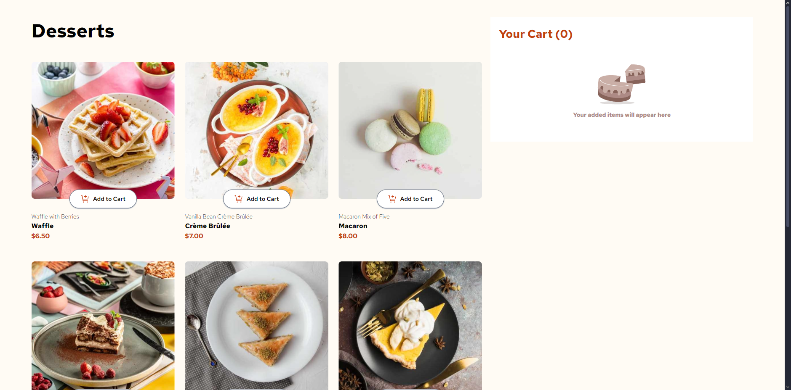

# Vite + React Project



Este é um projeto de front-end utilizando **Vite** como bundler, **React** como framework de UI, e **Tailwind CSS** para estilização. O projeto também está configurado com **Prettier** e o plugin **Prettier-plugin-tailwindcss** para garantir que as classes Tailwind sejam organizadas automaticamente na ordem recomendada.

## Funcionalidades

- Utilização do **Vite** para desenvolvimento rápido e otimizado.
- Estilização com **Tailwind CSS** para uma abordagem de design responsivo e moderna.
- Formatação automática das classes Tailwind com o **Prettier-plugin-tailwindcss**.
- Sistema de **carrinho de compras** com atualização dinâmica de quantidades e preço.

## Pré-requisitos

Antes de rodar o projeto, você precisa ter os seguintes programas instalados:

- **Node.js** (versão 16 ou superior)
- **npm** (gerenciador de pacotes do Node.js)

## Instalação

1. **Clone o repositório** para sua máquina local:

   ```bash
   git clone https://github.com/seu-usuario/vite-project.git
   cd vite-project
   ```

2. **Instale as dependências** do projeto:

   ```bash
   npm install
   ```

## Como Executar o Projeto

Para iniciar o servidor de desenvolvimento, execute o seguinte comando no terminal:

```bash
npm run dev
```

Isso vai iniciar o servidor local, e você poderá acessar o projeto no navegador em `http://localhost:3000`.

## Scripts

- `npm run dev`: Inicia o servidor de desenvolvimento com Vite.
- `npm run build`: Cria a versão otimizada para produção do seu aplicativo.
- `npm run lint`: Executa o ESLint para verificar problemas de estilo de código e boas práticas.
- `npm run preview`: Executa o aplicativo no modo de pré-visualização após a construção.

## Estrutura do Projeto

- `src/`: Contém todos os arquivos de código fonte do projeto.
  - `assets/`: Contém os arquivos estáticos, como imagens e ícones.
  - `components/`: Contém os componentes reutilizáveis do React.
  - `App.jsx`: O componente principal do aplicativo.
  - `main.jsx`: Ponto de entrada para o React.
  - `data.json`: Contém dados estáticos para produtos.
- `index.html`: Arquivo HTML principal.

- `tailwind.config.js`: Configuração do Tailwind CSS.

- `vite.config.js`: Configuração do Vite.

- `.prettierrc`: Configuração do Prettier para formatação de código.

## Configuração do Prettier

O projeto está configurado com **Prettier** e **prettier-plugin-tailwindcss** para formatação automática das classes CSS do Tailwind.

Certifique-se de ter o **Prettier** instalado globalmente ou na sua IDE para que o formato do código seja mantido.

Se estiver usando **VSCode**, você pode ativar a formatação automática ao salvar. Vá até as configurações e ative a opção `Editor: Format On Save`.

## Como Usar o Carrinho de Compras

O carrinho de compras permite que o usuário adicione itens, altere a quantidade e veja o preço total da compra.

1. **Adicionar ao Carrinho**: Clique no botão "Add to Cart" para adicionar um item ao carrinho.
2. **Alterar Quantidade**: Após adicionar um item, você pode incrementar ou decrementar a quantidade.
3. **Confirmar Pedido**: Depois de revisar os itens no carrinho, você pode confirmar o pedido clicando no botão "Confirm Order".

## Responsividade

O projeto é responsivo e utiliza o **Tailwind CSS** para se adaptar a diferentes tamanhos de tela (mobile, tablet e desktop). As imagens são carregadas de acordo com o tamanho da tela para melhorar o desempenho.

## Licença

Este projeto está sob a licença MIT - consulte o arquivo [LICENSE](LICENSE) para mais detalhes.
